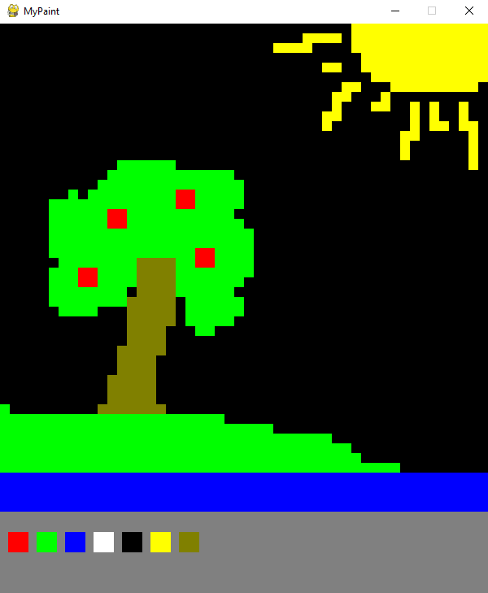

# MyPaint-pygame
Simple paint software made in pygame. It helped me learn a lot about pygame and how to interact with the window. Is very basic, need to add some essencial features.
```
Press R KEY to reset the screen
```


